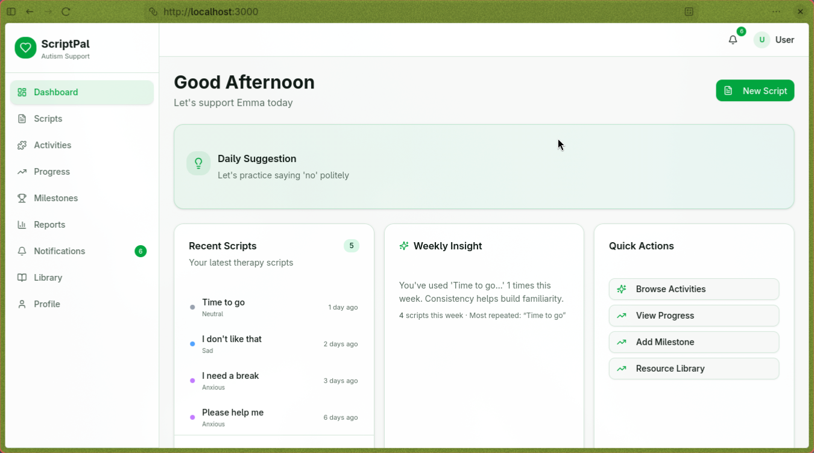
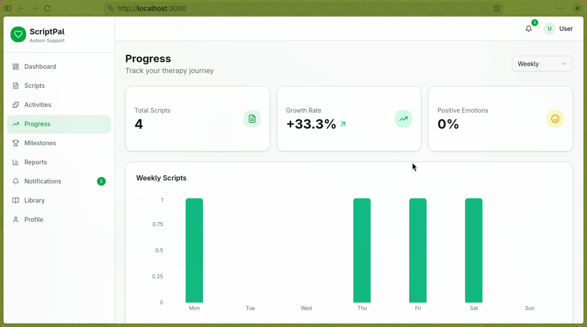

# ScriptPal - Autism Support Application

[](https://choosealicense.com/licenses/mit/)
[](https://github.com/heyaankit/ScriptPal/stargazers)
[](https://github.com/heyaankit/ScriptPal/issues)
[](https://www.python.org/)
[](https://fastapi.tiangolo.com/)
[](https://nextjs.org/)

A full-stack communication and progress tracking tool for children with autism and their caregivers.

## Screenshots





[View all screenshots →](https://github.com/heyaankit/ScriptPal/tree/main/app_images)

## Overview

ScriptPal helps caregivers track their child's communication progress, manage therapy scripts, and monitor development milestones through an intuitive interface.

## Tech Stack

### Backend
- **Framework**: FastAPI
- **Database**: SQLite with SQLAlchemy
- **Authentication**: JWT + OTP
- **Validation**: Pydantic

### Frontend
- **Framework**: Next.js 15 with App Router
- **UI**: React 19, Tailwind CSS 4, shadcn/ui
- **Charts**: Recharts
- **Icons**: Lucide React

## How to Use This Repo

### 1. Clone and Setup

```bash
git clone https://github.com/heyaankit/ScriptPal.git
cd ScriptPal
```

### 2. Start Backend

```bash
# Create and activate virtual environment
python -m venv .venv
source .venv/bin/activate

# Install dependencies
pip install -r requirements.txt

# Run server
uvicorn main:app --reload
```

Backend runs at: http://127.0.0.1:8000
API Docs: http://127.0.0.1:8000/docs

### 3. Start Frontend

```bash
cd frontend

# Install dependencies
npm install

# Run development server
npm run dev
```

Frontend runs at: http://localhost:3000

### 4. Seed Demo Data (Optional)

The app comes with 2 demo users pre-populated. To regenerate:

```bash
python -m app.seed_demo
```

### Demo Login

| Phone | Name | Child | Country Code |
|-------|------|-------|--------------|
| 5550000001 | Sarah Johnson | Emma (5 years) | +1 |
| 5550000002 | Michael Chen | Alex (4 years) | +1 |

Use any phone number to register new users, or use the demo accounts above.

## Features

- **Authentication**: OTP-based login system
- **Scripts Management**: Create, read, update, delete communication scripts
- **Dashboard**: Personalized dashboard with daily suggestions and insights
- **Progress Tracking**: Weekly, monthly, quarterly progress analytics
- **Milestones**: Track and celebrate achievements
- **Reports**: Generate and schedule progress reports
- **Library**: Pre-defined communication resources
- **Activities**: Interactive activities for children
- **Notifications**: Activity and milestone notifications
- **Profile Management**: User profile with child information

## API Endpoints

### Authentication
| Method | Endpoint | Description |
|--------|----------|--------------|
| POST | `/api/v1/auth/request-otp` | Request OTP for registration |
| POST | `/api/v1/auth/register` | Register with OTP |
| POST | `/api/v1/auth/request-login-otp` | Request OTP for login |
| POST | `/api/v1/auth/login` | Login with OTP |

### Scripts (5 endpoints)
| Method | Endpoint | Description |
|--------|----------|--------------|
| POST | `/api/v1/scripts` | Create script |
| GET | `/api/v1/scripts` | List scripts |
| GET | `/api/v1/scripts/{id}` | Get script |
| PATCH | `/api/v1/scripts/{id}` | Update script (partial) |
| DELETE | `/api/v1/scripts/{id}` | Delete script |

### Dashboard (2 endpoints)
| Method | Endpoint | Description |
|--------|----------|--------------|
| GET | `/api/v1/dashboard` | Dashboard data |
| GET | `/api/v1/dashboard/notification-count` | Unread notifications |

### Progress (6 endpoints)
| Method | Endpoint | Description |
|--------|----------|--------------|
| GET | `/api/v1/progress/summary` | Progress summary |
| GET | `/api/v1/progress/weekly` | Weekly chart |
| GET | `/api/v1/progress/emotions` | Emotions chart |
| GET | `/api/v1/progress/trends` | Long-term trends |
| POST | `/api/v1/milestones` | Create milestone |
| GET | `/api/v1/milestones` | List milestones |

### Reports (9 endpoints)
| Method | Endpoint | Description |
|--------|----------|--------------|
| GET | `/api/v1/reports/current` | Current report |
| POST | `/api/v1/reports/generate` | Generate report |
| POST | `/api/v1/reports/{id}/share-email` | Share via email |
| GET | `/api/v1/reports/schedules` | List schedules |
| POST | `/api/v1/reports/schedules` | Create schedule |
| PATCH | `/api/v1/reports/schedules/{id}` | Update schedule |
| DELETE | `/api/v1/reports/schedules/{id}` | Delete schedule |
| GET | `/api/v1/reports/history` | Report history |
| GET | `/api/v1/reports/{id}/download` | Download report |

### Library (2 endpoints)
| Method | Endpoint | Description |
|--------|----------|--------------|
| GET | `/api/v1/library` | List resources |
| GET | `/api/v1/library/{id}` | Get resource |

### Activities (4 endpoints)
| Method | Endpoint | Description |
|--------|----------|--------------|
| GET | `/api/v1/activities` | List activities |
| GET | `/api/v1/activities/{id}` | Get activity |
| POST | `/api/v1/activity-logs` | Log activity |
| GET | `/api/v1/activity-logs` | Activity logs |

### Notifications (2 endpoints)
| Method | Endpoint | Description |
|--------|----------|--------------|
| GET | `/api/v1/notifications` | List notifications |
| PATCH | `/api/v1/notifications/{id}/read` | Mark as read |

### Profile (2 endpoints)
| Method | Endpoint | Description |
|--------|----------|--------------|
| GET | `/api/v1/profile` | Get profile |
| PATCH | `/api/v1/profile` | Update profile |

## Response Format

All API responses follow this envelope format:

**Success:**
```json
{
  "success": true,
  "data": { ... },
  "message": "Operation successful"
}
```

**Error:**
```json
{
  "success": false,
  "error": "Error description"
}
```

## Pagination

List endpoints support pagination:
```
?page=1&page_size=20
```

Response includes:
```json
{
  "data": [...],
  "pagination": {
    "page": 1,
    "page_size": 20,
    "total_items": 45,
    "total_pages": 3
  }
}
```

## Environment Variables

Create a `.env` file or the defaults in `app/config.py` will be used:
- `DATABASE_URL`: SQLite database path (default: `sqlite:///./data/app.db`)
- `SECRET_KEY`: JWT secret key
- `ALGORITHM`: JWT algorithm (default: HS256)
- `ACCESS_TOKEN_EXPIRE_MINUTES`: Token expiry (default: 30)
- `OTP_LENGTH`: OTP digits (default: 6)
- `OTP_EXPIRE_MINUTES`: OTP validity (default: 5)

## License

MIT